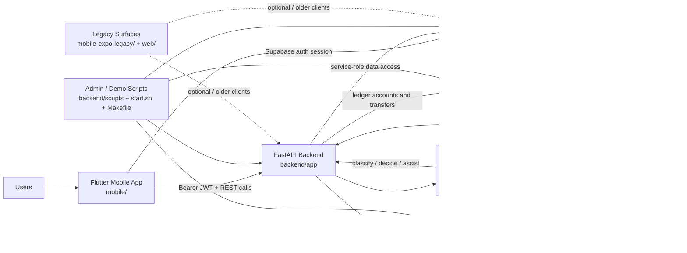
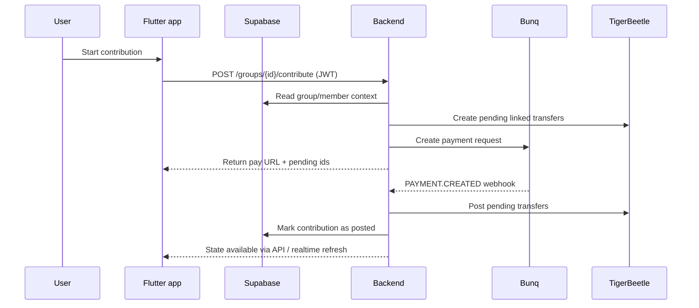

# Kitty Architecture

This repo is a multi-service ROSCA savings app built around four core runtime pieces:

- `mobile/`: Flutter client for members and admins
- `backend/`: FastAPI orchestration layer and agent runtime
- `supabase/`: app database, auth, and event/realtime foundation
- `TigerBeetle + bunq`: money-state ledger plus external banking rail

## High-Level Diagram

## Runtime Boundaries

### 1. Client layer

The primary client is the Flutter app in `mobile/`. It:

- authenticates users with Supabase
- stores the active Supabase session locally
- attaches the Supabase access token to backend API requests
- exposes member flows such as wallet, circles, invites, bidding, and admin views

## 2. Backend orchestration

The FastAPI app in `backend/app/main.py` is the system hub. It exposes route groups for:

- auth and profile
- groups, members, and invites
- matchmaker and lifecycle flows
- contributions, payouts, disputes, emergencies, and chat
- admin operations
- bunq webhook ingestion

The backend is responsible for joining together app state, ledger state, bunq state, and agent decisions.

## 3. Data and auth

Supabase is the app system of record for product data and authentication:

- mobile uses the anon key for auth/session management
- backend uses the service-role key for trusted server-side access
- SQL migrations in `supabase/migrations/` define the schema and policies

Typical tables referenced by the backend include groups, members, contributions, messages, and event/audit-style records.

## 4. Money architecture

Money handling is intentionally split in two:

- `bunq` moves real money and provides external payment/account primitives
- `TigerBeetle` enforces internal accounting invariants with double-entry transfers

A key pattern in the repo is:

1. backend creates a bunq payment request
2. backend creates matching pending TigerBeetle transfers
3. bunq webhook confirms payment arrival
4. backend posts the pending TigerBeetle transfers
5. Supabase records are updated to reflect the committed contribution

This gives the app a clear separation between bank-side events and internal ledger truth.

## 5. Agent layer

The `backend/app/agents/` package provides specialized LLM-driven roles. They all sit on top of a shared `BaseAgent` runtime that:

- runs Anthropic-backed tool loops
- sanitizes user-authored input before model calls
- logs tool usage for auditability
- forces state changes to happen through explicit tools instead of free-text replies

These agents do not replace the backend. They sit behind the API and help with social and coordination decisions, while the backend still owns routing, persistence, ledger calls, and banking integrations.

### Agent responsibilities

- `router`: classifies incoming group chat into intents such as contribution help, dispute, emergency, charter question, payout preference, or general chat so the backend can route to the right workflow.
- `matchmaker`: evaluates a user’s preferences and trust score against admin-opened circles and the waitlist, then decides whether to join an existing circle, fill a nearly-complete one, or add the user to the waitlist.
- `constitution`: interviews the founder, drafts the group charter in structured JSON, iterates on terms like contribution amount, penalties, payout policy, and early-exit rules, then finalizes the charter.
- `vetting`: reads a prospective member’s bunq transaction summary plus Kitty reputation history and writes a bounded `trust_score` with rationale to the user profile.
- `collector`: sends culturally-aware contribution reminders, escalates tone based on lateness, and opens a mediation path when collection has failed for too long.
- `bidding`: resolves multi-bid payout cycles by scoring urgency/reason quality, applying anti-gaming adjustments, and selecting a weighted-random winner that can be replayed for audit.
- `payout optimizer`: computes the overall payout order from member month preferences using constraint solving so each member gets a unique slot with minimal deviation from preferred timing.
- `mediator`: handles payment disputes by comparing TigerBeetle state, bunq transaction history, and uploaded receipt evidence, then issues a verdict and can trigger corrective ledger transfers.
- `emergency`: manages early exits and hardship cases by computing a fair buyout from ledger state, proposing terms to the group, and executing the unwind once consent is reached.
- `auditor`: issues signed reputation or “passport” events at cycle boundaries or group completion, updates trust scores, and records outcome-based score deltas for each member.

### How agents interact with the rest of the system

- Most agents read and write app state through Supabase tables such as `groups`, `members`, `messages`, `events`, `charters`, `disputes`, `emergencies`, `bids`, and `reputation_events`.
- Money-affecting agents such as `mediator` and `emergency` can only change balances through explicit TigerBeetle transfer tools.
- Agents that need banking context, especially `vetting` and `mediator`, read summary or transaction data through the backend’s bunq client rather than calling bunq directly from the mobile app.
- Agent outputs often become durable application events: chat messages, audit log entries, waitlist decisions, trust scores, charter versions, dispute verdicts, or payout winners.

## 6. Dev and support surfaces

Supporting repo pieces:

- `start.sh`, `stop.sh`, and `docker-compose.yml` boot local backend and TigerBeetle
- `backend/scripts/` handles bootstrap and demo seeding
- `third_party/bunq_toolkit/` supports sandbox-user/session setup
- `mobile-expo-legacy/` and `web/` appear to be earlier or experimental client surfaces, not the main active architecture

## Request Flow Example

## Practical Summary

If you need to reason about the repo quickly, the simplest mental model is:

- Supabase owns user identity and app data
- FastAPI owns workflow orchestration
- TigerBeetle owns accounting correctness
- bunq owns external money movement
- agents help with social decision-making around the savings circle
